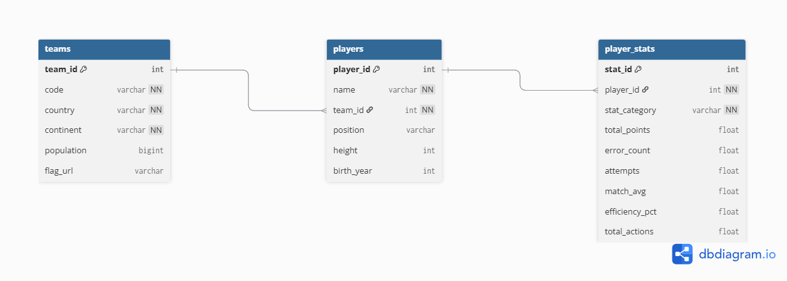

# 🏐 VNL 2024 — Player Performance Analytics

**MSc2 Manager Data Marketing | Algo & Bases de Données 2026**

---

## 📌 Problématique métier

La Volleyball Nations League (VNL) 2024 réunit les 16 meilleures nations mondiales.  
Dans un contexte de scouting sportif et de sponsoring, **comment identifier objectivement les joueurs les plus performants** pour orienter des décisions de recrutement ou de partenariat ?

Ce projet construit un pipeline data complet — de la base SQL au dashboard interactif — pour répondre à cette question via un algorithme de scoring inspiré de la logique RFM marketing.

---

## 🗂️ Structure du projet

```
vnl2024-data-marketing/
├── .env                          ← Credentials MySQL (non commité)
├── .gitignore
├── README.md
├── data/
│   └── raw/                      ← 8 fichiers CSV source (Kaggle)
├── sql/
│   └── init_db.sql               ← Création base + tables + données
├── requetes/
│   ├── ddl.sql                   ← CREATE TABLE et contraintes
│   ├── select.sql                ← Requêtes SELECT (WHERE, GROUP BY...)
│   ├── jointures.sql             ← Jointures sur 3 tables
│   ├── sous-requetes.sql         ← Sous-requêtes imbriquées
│   ├── cte.sql                   ← Common Table Expressions + RANK()
│   ├── views.sql                 ← CREATE VIEW
│   └── fonctions-procedures.sql  ← Procédures stockées + fonction
├── python/
│   ├── pipeline.py               ← Connexion MySQL, API, algo PPS, export
│   └── requirements.txt
├── dashboard/
│   ├── app.py                    ← Dashboard Plotly Dash interactif
└── assets/
    └── schema.png                ← Capture du schéma dbdiagram.io
```

---

## 🗃️ Modélisation de la base de données

### Schéma



### Tables

| Table | Description | Lignes |
|-------|-------------|--------|
| `teams` | 16 équipes nationales VNL 2024 | 16 |
| `players` | Joueurs participants | 304 |
| `player_stats` | Stats par joueur et par catégorie (many-to-many) | ~1 200 |
| `player_scores` | Résultats de l'algorithme PPS (générés par Python) | 304 |

### Relations
- `players` → `teams` : Many-to-one (FOREIGN KEY)
- `player_stats` → `players` : Many-to-many (un joueur, plusieurs catégories de stats)
- `player_scores` → `players` : One-to-one (FOREIGN KEY)

### Contraintes
- `UNIQUE` sur `teams.code` et `(player_id, stat_category)`
- `NOT NULL` sur les champs obligatoires
- `FOREIGN KEY` sur `team_id` et `player_id`

---

## ⚙️ Installation et lancement

### Prérequis
- Python 3.8+
- MySQL 8.0+
- VS Code avec l'extension Database Client

### 1. Cloner le repo
```bash
git clone https://github.com/marcusspina03-ops/vnl2024-data-marketing.git
cd vnl2024-data-marketing
```

### 2. Installer les dépendances Python
```bash
pip install -r python/requirements.txt
```

### 3. Configurer les credentials
Crée un fichier `.env` à la racine :
```env
DB_HOST=localhost
DB_USER=root
DB_PASSWORD=mot_de_passe
DB_NAME=vnl2024
```

### 4. Initialiser la base de données
Exécuter `sql/init_db.sql` dans VS Code.

### 5. Lancer le pipeline Python
```
python python/pipeline.py
```

### 6. Lancer le dashboard
```
python dashboard/app.py
```
Puis ouvrir **http://127.0.0.1:8050** dans le navigateur.

---

## 🔄 Pipeline Python

Le pipeline `pipeline.py` réalise 4 étapes :

**1. Chargement** — Connexion MySQL via `.env`, extraction avec Pandas  
**2. Enrichissement API** — Appel à [REST Countries API](https://restcountries.com) pour chaque équipe : population et drapeau  
**3. Algorithme PPS** — Calcul du Player Performance Score  
**4. Export** — Écriture des résultats dans la table `player_scores`

---

## 📊 Algorithme : Player Performance Score (PPS)

Inspiré de la logique **RFM** (Récence, Fréquence, Montant) en marketing, le PPS score chaque joueur sur **3 dimensions sportives** :

| Dimension | Poids | Métriques |
|-----------|-------|-----------|
| Attaque | 40% | Points marqués + efficacité |
| Service | 30% | Points au service + moyenne/match |
| Block | 30% | Points au block + moyenne/match |

Chaque dimension est **normalisée entre 0 et 10**, puis combinée en une moyenne pondérée.

### Segmentation (équivalent segments RFM)

| Segment | PPS | Interprétation |
|---------|-----|----------------|
| 🥇 Elite | ≥ 7 | Joueur à recruter en priorité |
| ✅ Confirmed | ≥ 4 | Joueur solide et fiable |
| 📊 Average | ≥ 2 | Joueur dans la moyenne |
| ⬇️ Low | < 2 | Peu performant sur la compétition |

---

## 📈 Dashboard interactif

Le dashboard Plotly Dash permet d'explorer les performances avec :

**Filtres**
- Sélection par équipe
- Sélection par position (OH, MB, S, O, L)
- Seuil de PPS minimum (slider)

**KPIs**
- Meilleur joueur avec drapeau du pays
- Nombre de joueurs Elite
- PPS moyen de la sélection

**Visualisations**
- Top 20 joueurs par PPS (barres horizontales)
- Répartition des segments (donut)
- PPS moyen par équipe (barres verticales)
- Tableau interactif trié par colonne

---

## 📦 Sources des données

- **Dataset** : [VNL 2024 Men Statistics — Kaggle](https://www.kaggle.com/datasets/jonathanpmoyer/vnl-2024-mens-stats)
- **API** : [REST Countries](https://restcountries.com/v3.1/alpha/{code}) — population et drapeaux

---

## 🛠️ Stack technique

| Outil | Usage |
|-------|-------|
| MySQL 8.0 | Base de données relationnelle |
| Python 3 | Pipeline de données |
| Pandas | Manipulation des données |
| Requests | Appels API REST |
| Plotly / Dash | Dashboard interactif |
| python-dotenv | Gestion sécurisée des credentials |
| Git / GitHub | Versioning et livraison |
